# QuantumShield Security System - Work Documentation

**Author:** Security Intern  
**Date:** December 2025  
**Components:** Frontend Dashboard, DVWA Honeypot Target, Integrations (Chatbot, Slack, Email)

---

## Table of Contents

1. [Executive Summary](#1-executive-summary)
2. [Frontend Dashboard](#2-frontend-dashboard)
   - [Architecture Overview](#21-architecture-overview)
   - [Components Breakdown](#22-components-breakdown)
   - [API Integration](#23-api-integration)
   - [Type Definitions](#24-type-definitions)
3. [DVWA - Vulnerable Web Application](#3-dvwa---vulnerable-web-application)
   - [Purpose & Design](#31-purpose--design)
   - [Vulnerable Endpoints](#32-vulnerable-endpoints)
   - [Database Schema](#33-database-schema)
4. [AI Chatbot Integration](#4-ai-chatbot-integration)
   - [Architecture](#41-architecture)
   - [Frontend Implementation](#42-frontend-implementation)
   - [Backend API](#43-backend-api)
   - [Features](#44-features)
5. [Email Alert Notification System](#5-email-alert-notification-system)
   - [Implementation](#51-implementation)
   - [Alert Triggers](#52-alert-triggers)
   - [Email Template](#53-email-template)
6. [Slack Integration](#6-slack-integration)
   - [Implementation](#61-implementation)
   - [Alert Types](#62-alert-types)
   - [Configuration](#63-configuration)
7. [Architecture Diagrams](#7-architecture-diagrams)
8. [API Reference](#8-api-reference)
9. [Configuration Guide](#9-configuration-guide)
10. [Testing & Verification](#10-testing--verification)

---

## 1. Executive Summary

This documentation covers the development of a comprehensive security monitoring system consisting of:

| Component | Technology | Port | Purpose |
|-----------|-----------|------|---------|
| **Frontend Dashboard** | Next.js 16, React 19, TypeScript | 3001 | Real-time security monitoring UI |
| **DVWA** | Next.js, SQLite | 3000 | Intentionally vulnerable honeypot target |
| **AI Chatbot** | React + LLM API | - | Natural language query interface |
| **Email Alerts** | SendGrid API | - | Attack notification system |
| **Slack Integration** | Slack Webhook API | - | Team notification system |

### Key Achievements

✅ Built a modern, responsive security dashboard with real-time attack monitoring  
✅ Developed an intentionally vulnerable web application (DVWA) for honeypot testing  
✅ Implemented AI-powered chatbot for natural language security queries  
✅ Created automated email alert system via SendGrid  
✅ Built Slack integration for real-time team notifications  
✅ Integrated with ML-based attack detection system  

---

## 2. Frontend Dashboard

### 2.1 Architecture Overview

The frontend is built with **Next.js 16** and **React 19**, providing a modern, responsive security monitoring dashboard.

**Directory Structure:**
```
frontend/
├── app/
│   ├── layout.tsx          # Root layout with metadata
│   ├── page.tsx            # Main dashboard
│   ├── globals.css         # Global styles
│   └── reports/
│       └── page.tsx        # Reports page
├── components/
│   ├── ChatBot.tsx         # AI chatbot component
│   ├── ChatMessage.tsx     # Chat message renderer
│   ├── LiveAttackFeed.tsx  # Real-time attack stream
│   ├── StatsCards.tsx      # Dashboard statistics
│   ├── SessionsTable.tsx   # Active sessions table
│   └── AttackPatterns.tsx  # Attack visualization charts
├── lib/
│   ├── api.ts              # API client functions
│   └── types.ts            # TypeScript type definitions
└── public/                 # Static assets
```

### 2.2 Components Breakdown

#### 2.2.1 Main Dashboard (`app/page.tsx`)

The main dashboard provides a comprehensive view of security metrics:

**Features:**
- Real-time statistics cards (total interactions, active sessions, 24h activity)
- Live attack feed with severity indicators
- Attack pattern distribution (pie chart)
- Active sessions table with AI analysis
- Auto-refresh every 5 seconds
- Error handling for backend connectivity

**Key Code:**
```typescript
// Auto-refresh mechanism
useEffect(() => {
    fetchData();
    const interval = setInterval(fetchData, 5000);
    return () => clearInterval(interval);
}, []);

// Parallel data fetching
const [statsData, sessionsData, logsData, patternsData] = await Promise.all([
    api.getStats(),
    api.getSessions(true),
    api.getLogs(undefined, 50),
    api.getPatterns(),
]);
```

#### 2.2.2 ChatBot Component (`components/ChatBot.tsx`)

**Features:**
- Floating chat button with pulse indicator
- Natural language input with suggestions
- Message history with auto-scroll
- Loading states with animated indicators
- Session forensics analysis on click
- Clear chat functionality

**State Management:**
```typescript
const [isOpen, setIsOpen] = useState(false);
const [messages, setMessages] = useState<ChatMessageType[]>([]);
const [input, setInput] = useState('');
const [isLoading, setIsLoading] = useState(false);
const [suggestions, setSuggestions] = useState<string[]>([]);
```

**Key Methods:**
- `handleSend()`: Sends query to backend, displays response
- `handleSessionClick()`: Triggers forensics analysis for a session
- `fetchSuggestions()`: Gets query suggestions from API

#### 2.2.3 ChatMessage Component (`components/ChatMessage.tsx`)

**Render Types Supported:**
| Type | Description | Visualization |
|------|-------------|---------------|
| `text` | Plain text response | Formatted text with session links |
| `table` | Tabular data | Responsive data table |
| `bar_chart` | Comparative data | Horizontal bar chart |
| `pie_chart` | Distribution data | Interactive pie chart |
| `line_chart` | Time-series data | Line chart with tooltips |
| `forensics` | Session analysis | Detailed forensics panel |

**Forensics Display:**
```typescript
const renderForensics = () => {
    // Displays:
    // - Session ID and IP address
    // - Threat level badge (Low/Medium/High/Critical)
    // - Command history with terminal styling
    // - AI-generated analysis
    // - Blocked actions list
};
```

#### 2.2.4 LiveAttackFeed Component (`components/LiveAttackFeed.tsx`)

**Features:**
- Real-time attack stream with newest first
- Color-coded severity badges (CRITICAL, HIGH, MEDIUM, LOW)
- Attack type labels (SQL Injection, XSS, Command Injection, etc.)
- ML confidence bar with percentage
- Request/response payload preview
- Response time metrics

#### 2.2.5 StatsCards Component (`components/StatsCards.tsx`)

**Metrics Displayed:**
- Total Interactions
- Active Sessions
- Recent Activity (24h)
- Cache Hit Rate
- LLM Model info
- Total LLM Requests
- Cache Efficiency

#### 2.2.6 SessionsTable Component (`components/SessionsTable.tsx`)

**Features:**
- Active/Inactive status indicators
- IP address display
- User agent truncation
- Session duration formatting
- Interaction count
- **AI Summary** button (triggers LLM analysis)
- **Attack Playback** button (step-by-step replay)
- Expandable session details

**Modal Dialogs:**
1. **AI Summary Modal**: Displays threat analysis with risk score, MITRE ATT&CK tactics
2. **Attack Playback Modal**: Step-by-step attack reconstruction

#### 2.2.7 AttackPatterns Component (`components/AttackPatterns.tsx`)

**Features:**
- Interactive pie chart (Recharts)
- Color-coded attack types
- Legend with attack counts
- Responsive layout

### 2.3 API Integration

**API Client (`lib/api.ts`):**

```typescript
const API_BASE = process.env.NEXT_PUBLIC_API_URL || 'http://localhost:8000';

export const api = {
    // Analytics endpoints
    getStats(): Promise<Stats>,
    getSessions(activeOnly: boolean): Promise<{ count: number; sessions: Session[] }>,
    getLogs(sessionId?: string, limit?: number): Promise<{ logs: Log[] }>,
    getPatterns(): Promise<{ attack_types: AttackPattern[]; top_ips: AttackPattern[] }>,
    getTimeline(hours: number): Promise<{ data: TimelineData[] }>,
    getThreatSummary(sessionId: string): Promise<any>,
    getAttackPlayback(sessionId: string): Promise<any>,
    downloadWeeklyReport(): Promise<Blob>,
    
    // Chat endpoints
    sendChatQuery(message: string): Promise<ChatQueryResponse>,
    getForensicsAnalysis(sessionId: string): Promise<ForensicsData>,
    getChatSuggestions(): Promise<ChatSuggestions>,
};
```

### 2.4 Type Definitions

**Core Types (`lib/types.ts`):**

```typescript
// Session tracking
interface Session {
    session_id: string;
    ip_address: string;
    user_agent: string;
    start_time: string;
    active: boolean;
    duration_seconds?: number;
    context: {
        current_directory: string;
        user: string;
        history: Array<{ cmd: string; res: string }>;
    };
}

// Attack logs
interface Log {
    timestamp: string;
    session_id: string;
    ip: string;
    type: string;
    payload: string;
    response: string;
    attack_type?: string;
    severity?: 'LOW' | 'MEDIUM' | 'HIGH' | 'CRITICAL';
    ml_verdict?: string;
    ml_confidence?: number;
    http_method?: string;
    path?: string;
}

// Chat types
interface ChatMessage {
    id: string;
    role: 'user' | 'assistant';
    content: string;
    render_type?: 'text' | 'table' | 'bar_chart' | 'pie_chart' | 'line_chart' | 'forensics';
    data?: ChartDataPoint[] | TableRow[] | ForensicsData;
    timestamp: Date;
}

// Forensics analysis
interface ForensicsData {
    session_id: string;
    ip_address?: string;
    command_history: Array<{ cmd: string; res: string }>;
    analysis: string;
    intent: string;
    threat_level: string;
    blocked_actions: string[];
}
```

---

## 3. DVWA - Vulnerable Web Application

### 3.1 Purpose & Design

DVWA (Damn Vulnerable Web Application) serves as a **honeypot target** - an intentionally vulnerable e-commerce site that attracts attackers and records their behavior.

**Directory Structure:**
```
dvwa/
├── app/
│   ├── layout.tsx
│   ├── page.tsx              # Product catalog (home)
│   ├── login/page.tsx        # Login form
│   ├── product/[id]/page.tsx # Product details
│   ├── profile/page.tsx      # User profile
│   └── api/
│       ├── auth/route.ts     # ⚠️ VULNERABLE - SQL Injection
│       ├── products/route.ts # ⚠️ VULNERABLE - SQL Injection
│       ├── orders/route.ts
│       └── reviews/route.ts
├── lib/
│   └── db.ts                 # SQLite database connection
└── shop.db                   # SQLite database file
```

### 3.2 Vulnerable Endpoints

#### 3.2.1 Authentication API (`app/api/auth/route.ts`)

**Vulnerability:** SQL Injection in login query

```typescript
// VULNERABLE CODE - String concatenation without sanitization
const query = `SELECT * FROM users WHERE username = '${username}' AND password = '${password}'`
```

**Exploitation Example:**
```
Username: admin' OR 1=1--
Password: anything
```

**Why It Works:**
The query becomes:
```sql
SELECT * FROM users WHERE username = 'admin' OR 1=1--' AND password = 'anything'
```
The `--` comments out the password check, and `1=1` is always true.

#### 3.2.2 Products Search API (`app/api/products/route.ts`)

**Vulnerability:** SQL Injection in search parameter

```typescript
// VULNERABLE CODE
const query = `SELECT * FROM products WHERE name LIKE '%${search}%' OR description LIKE '%${search}%'`
```

**Exploitation Example:**
```
Search: iPhone' OR 1=1--
```

### 3.3 Database Schema

**SQLite Database (`shop.db`):**

```sql
-- Users table
CREATE TABLE users (
    id INTEGER PRIMARY KEY AUTOINCREMENT,
    username TEXT UNIQUE NOT NULL,
    email TEXT UNIQUE NOT NULL,
    password TEXT NOT NULL,
    profile_pic TEXT DEFAULT '/default-avatar.png',
    created_at DATETIME DEFAULT CURRENT_TIMESTAMP
);

-- Products table
CREATE TABLE products (
    id INTEGER PRIMARY KEY AUTOINCREMENT,
    name TEXT NOT NULL,
    description TEXT,
    price REAL NOT NULL,
    image TEXT,
    stock INTEGER DEFAULT 0
);

-- Orders table
CREATE TABLE orders (
    id INTEGER PRIMARY KEY AUTOINCREMENT,
    user_id INTEGER NOT NULL,
    product_id INTEGER NOT NULL,
    quantity INTEGER NOT NULL,
    total REAL NOT NULL,
    status TEXT DEFAULT 'pending',
    created_at DATETIME DEFAULT CURRENT_TIMESTAMP
);

-- Reviews table
CREATE TABLE reviews (
    id INTEGER PRIMARY KEY AUTOINCREMENT,
    product_id INTEGER NOT NULL,
    user_id INTEGER NOT NULL,
    rating INTEGER NOT NULL,
    comment TEXT,
    created_at DATETIME DEFAULT CURRENT_TIMESTAMP
);
```

**Seeded Data:**
- Users: admin, john, alice
- Products: iPhone 15 Pro, Samsung Galaxy S24, MacBook Pro M3, Dell XPS 15, AirPods Pro, Sony WH-1000XM5

---

## 4. AI Chatbot Integration

### 4.1 Architecture

```
┌─────────────────┐     ┌──────────────────┐     ┌─────────────────┐
│   Frontend      │     │   Backend        │     │   LLM API       │
│   ChatBot.tsx   │────▶│   routers/chat.py│────▶│   OpenAI/Groq   │
│   ChatMessage   │◀────│                  │◀────│                 │
└─────────────────┘     └──────────────────┘     └─────────────────┘
                               │
                               ▼
                        ┌──────────────────┐
                        │   MongoDB        │
                        │   logs/sessions  │
                        └──────────────────┘
```

### 4.2 Frontend Implementation

**ChatBot.tsx Key Features:**

1. **Floating Button:**
```jsx
<button className="fixed bottom-6 right-6 w-14 h-14 rounded-full bg-gradient-to-br from-cyan-500 to-blue-600">
    <MessageCircle className="w-6 h-6 text-white" />
    <span className="absolute -top-1 -right-1 w-3 h-3 bg-green-500 rounded-full animate-pulse" />
</button>
```

2. **Query Suggestions:**
```typescript
const fetchSuggestions = async () => {
    const data = await api.getChatSuggestions();
    setSuggestions(data.suggestions);
    // Returns: ["Show me all attacks", "Top attacking IPs", etc.]
};
```

3. **Message Handling:**
```typescript
const handleSend = async (messageText?: string) => {
    // Add user message to chat
    // Send to API
    const response = await api.sendChatQuery(text);
    // Add assistant message with render_type and data
};
```

4. **Session Forensics:**
```typescript
const handleSessionClick = async (sessionId: string) => {
    const forensics = await api.getForensicsAnalysis(sessionId);
    // Displays detailed analysis with threat level, intent, blocked actions
};
```

### 4.3 Backend API

**Chat Router (`routers/chat.py`):**

| Endpoint | Method | Description |
|----------|--------|-------------|
| `/api/chat/query` | POST | Process natural language query |
| `/api/chat/forensics/{session_id}` | POST | Analyze session behavior |
| `/api/chat/suggestions` | GET | Get query suggestions |

**Query Processing Flow:**

1. User sends natural language question
2. Backend builds LLM prompt with MongoDB schema reference
3. LLM translates question to MongoDB aggregation pipeline
4. Pipeline is executed against database
5. Results are formatted based on render_type
6. Response sent back to frontend

**Example Query Translation:**
```
User: "Show me SQL injection attempts in the last hour"

LLM Response:
{
    "collection": "logs",
    "pipeline": [
        {"$match": {"attack_type": "sql_injection", "timestamp": {"$gte": "..."}}}
    ],
    "render_type": "table",
    "explanation": "Found SQL injection attempts in the last hour"
}
```

### 4.4 Features

| Feature | Description |
|---------|-------------|
| **Natural Language Queries** | Ask questions in plain English |
| **MongoDB Translation** | Automatic query generation |
| **Interactive Charts** | Bar, Pie, Line charts via Recharts |
| **Session Forensics** | Click session IDs for AI analysis |
| **MITRE ATT&CK Mapping** | Attack technique classification |
| **Threat Level Assessment** | Low/Medium/High/Critical ratings |

**Suggested Queries:**
- "Show me all attacks in the last hour"
- "What are the top 10 attacking IPs?"
- "Show attack distribution by type"
- "How many attacks happened each hour today?"
- "Find high-confidence malicious attacks"
- "Show all active sessions"

---

## 5. Email Alert Notification System

### 5.1 Implementation

**Location:** `honeypot/core/email_notifier.py`

**Technology:** SendGrid API

```python
class EmailNotifier:
    def __init__(self):
        self.enabled = settings.ENABLE_EMAIL_ALERTS
        self.from_email = settings.ALERT_FROM_EMAIL
        self.to_email = settings.ALERT_TO_EMAIL
        self.client = SendGridAPIClient(settings.SENDGRID_API_KEY)
    
    async def send_attack_alert(
        self,
        ip: str,
        method: str,
        path: str,
        ml_verdict: str,
        ml_confidence: float,
        payload: str
    ):
        # Build HTML email content
        # Send via SendGrid API
```

### 5.2 Alert Triggers

Emails are sent when:
- ML verdict is **MALICIOUS**
- Confidence score ≥ **80%**

**Integration Point (`main.py`):**
```python
if ml_verdict == "MALICIOUS":
    background_tasks.add_task(
        email_notifier.send_attack_alert,
        ip=client_ip,
        method=method,
        path=path_name,
        ml_verdict=ml_verdict,
        ml_confidence=ml_confidence,
        payload=body_str[:500]
    )
```

### 5.3 Email Template

**Subject:** `🚨 MALICIOUS Attack Detected - {attack_type} from {ip}`

**HTML Content Includes:**
- Alert timestamp
- Attack type (auto-detected)
- Source IP address
- HTTP method
- Request path
- ML verdict and confidence score
- Payload preview (truncated to 500 chars)
- Link to dashboard

**Attack Type Detection:**
```python
def _infer_attack_type(self, method: str, path: str, payload: str) -> str:
    # SQL Injection patterns
    if any(pattern in payload_lower for pattern in ["' or ", "union select", "drop table"]):
        return "SQL Injection"
    
    # XSS patterns
    if any(pattern in payload_lower for pattern in ["<script", "javascript:"]):
        return "Cross-Site Scripting (XSS)"
    
    # Command Injection patterns
    if any(pattern in payload_lower for pattern in ["|", ";", "&&", "`"]):
        return "Command Injection"
```

---

## 6. Slack Integration

### 6.1 Implementation

**Location:** `honeypot/core/slack_notifier.py`

**Technology:** Slack Incoming Webhooks

```python
class SlackNotifier:
    def __init__(self):
        self.enabled = settings.ENABLE_SLACK_ALERTS
        self.webhook_url = settings.SLACK_WEBHOOK_URL
        self.channel = settings.SLACK_CHANNEL
    
    async def send_attack_alert(...):
        # Build Block Kit message
        # POST to webhook URL
```

### 6.2 Alert Types

#### 6.2.1 Real-time Attack Alerts

**Triggered:** For each MALICIOUS attack with confidence ≥ 80%

**Message Content:**
- Header with severity emoji (🔴/🟠/🟡)
- Attack type and source IP
- HTTP method and confidence
- Request path and timestamp
- Payload preview (code block)
- Link to dashboard

#### 6.2.2 Summary Alerts

**Purpose:** Periodic aggregated statistics

```python
async def send_summary_alert(
    total_attacks: int,
    malicious_count: int,
    top_attackers: list,
    attack_types: dict,
    time_period: str
):
```

**Message Content:**
- Total attacks count
- Malicious count
- Top 5 attackers (IP + count)
- Attack type distribution
- "View Dashboard" button

#### 6.2.3 Critical Threat Alerts

**Purpose:** High-priority alerts requiring immediate action

**Features:**
- `<!channel>` mention for visibility
- Threat description
- Recommended action
- "Block IP" danger button

```python
async def send_critical_threat_alert(
    ip: str,
    attack_count: int,
    threat_description: str,
    recommended_action: str
):
```

### 6.3 Configuration

**Environment Variables:**
```bash
ENABLE_SLACK_ALERTS=true
SLACK_WEBHOOK_URL=<your-slack-webhook-url>
SLACK_CHANNEL=#security-alerts
```

**Severity Indicators:**
| Confidence | Emoji | Color |
|------------|-------|-------|
| ≥ 90% | 🔴 | danger (red) |
| ≥ 80% | 🟠 | #FF9800 (orange) |
| < 80% | 🟡 | warning (yellow) |

---

## 7. Architecture Diagrams

### 7.1 System Overview

```mermaid
graph TB
    subgraph USERS["Users"]
        ADMIN["👤 Security Admin"]
        ATTACKER["🔴 Attacker"]
    end

    subgraph FRONTEND["Frontend (Port 3001)"]
        DASH["Dashboard"]
        CHAT["AI Chatbot"]
        REPORTS["Reports"]
    end

    subgraph DVWA["DVWA (Port 3000)"]
        PAGES["Vulnerable Pages"]
        APIS["Vulnerable APIs"]
        DB[("SQLite")]
    end

    subgraph HONEYPOT["Honeypot/WAF (Port 8080)"]
        PROXY["Reverse Proxy"]
        ML["ML Detection"]
        ALERT["Alert System"]
    end

    subgraph INTEGRATIONS["Integrations"]
        EMAIL["📧 SendGrid"]
        SLACK["💬 Slack"]
        LLM["🧠 LLM API"]
    end

    ADMIN --> DASH
    ADMIN --> CHAT
    ATTACKER --> PROXY
    PROXY --> PAGES
    ML --> ALERT
    ALERT --> EMAIL
    ALERT --> SLACK
    CHAT --> LLM
```



### 7.2 Data Flow

```
Attacker Request → Honeypot WAF → ML Classification
                                         ↓
                    ┌──────────────────────────────────┐
                    │         MALICIOUS (≥80%)         │
                    └──────────────────────────────────┘
                                         ↓
              ┌──────────────────────────┴──────────────────────────┐
              ↓                                                      ↓
        📧 Email Alert                                         💬 Slack Alert
        (SendGrid API)                                         (Webhook API)
              ↓                                                      ↓
        Security Team                                          #security-alerts
```

---

## 8. API Reference

### Frontend API Endpoints

| Endpoint | Method | Description |
|----------|--------|-------------|
| `/api/analytics/stats` | GET | Dashboard statistics |
| `/api/analytics/sessions` | GET | Active/all sessions |
| `/api/analytics/logs` | GET | Attack logs |
| `/api/analytics/patterns` | GET | Attack type distribution |
| `/api/analytics/timeline` | GET | Time-series data |
| `/api/analytics/summary/{id}` | GET | AI threat summary |
| `/api/analytics/playback/{id}` | GET | Attack playback |
| `/api/chat/query` | POST | Natural language query |
| `/api/chat/forensics/{id}` | POST | Session forensics |
| `/api/chat/suggestions` | GET | Query suggestions |

### DVWA API Endpoints

| Endpoint | Method | Vulnerability |
|----------|--------|---------------|
| `/api/auth` | POST | SQL Injection |
| `/api/products` | GET | SQL Injection (search) |
| `/api/products/[id]` | GET | IDOR |
| `/api/orders` | GET/POST | - |
| `/api/reviews` | GET/POST | XSS (stored) |

---

## 9. Configuration Guide

### Environment Variables

**Frontend (`frontend/.env`):**
```bash
NEXT_PUBLIC_API_URL=http://localhost:8080
```

**Honeypot (`honeypot/.env`):**
```bash
# Upstream (DVWA)
UPSTREAM_URL=http://localhost:3000

# Database
MONGO_URI=mongodb://localhost:27017
DB_NAME=shadow_guardian

# LLM (for chatbot)
GROQ_API_KEY=your_groq_api_key
LLM_MODEL=llama-3.1-70b-versatile

# Email Alerts
ENABLE_EMAIL_ALERTS=true
SENDGRID_API_KEY=SG.xxxxxxxxxxxxxxxxxxxxx
ALERT_FROM_EMAIL=alerts@yourdomain.com
ALERT_TO_EMAIL=security@yourdomain.com

# Slack Alerts
ENABLE_SLACK_ALERTS=true
SLACK_WEBHOOK_URL=<your-slack-webhook-url>
SLACK_CHANNEL=#security-alerts
```

---

## 10. Testing & Verification

### Test Chatbot

1. Open dashboard: `http://localhost:3001`
2. Click chatbot button (bottom right)
3. Try queries:
   - "Show all attacks"
   - "Top 5 attacking IPs"
   - "SQL injection attempts today"

### Test Email Alerts

```bash
cd honeypot
python test_email.py
```

### Test Slack Alerts

```bash
cd honeypot
python test_slack.py
```

### Test DVWA Vulnerabilities

1. Navigate to `http://localhost:3000/login`
2. Try SQL injection:
   - Username: `admin' OR 1=1--`
   - Password: `anything`
3. Check dashboard for detected attack

---

## Appendix: Files Summary

| File | Lines | Purpose |
|------|-------|---------|
| `frontend/app/page.tsx` | 171 | Main dashboard |
| `frontend/components/ChatBot.tsx` | 275 | AI chatbot UI |
| `frontend/components/ChatMessage.tsx` | 354 | Chat message renderer |
| `frontend/components/LiveAttackFeed.tsx` | 210 | Attack stream |
| `frontend/components/SessionsTable.tsx` | 414 | Sessions table |
| `frontend/components/StatsCards.tsx` | 98 | Statistics cards |
| `frontend/components/AttackPatterns.tsx` | 83 | Attack charts |
| `frontend/lib/api.ts` | 103 | API client |
| `frontend/lib/types.ts` | 122 | TypeScript types |
| `dvwa/app/page.tsx` | 142 | Product catalog |
| `dvwa/app/login/page.tsx` | 141 | Login page |
| `dvwa/app/api/auth/route.ts` | 62 | Vulnerable auth |
| `dvwa/app/api/products/route.ts` | 42 | Vulnerable search |
| `dvwa/lib/db.ts` | 147 | Database setup |
| `honeypot/core/email_notifier.py` | 217 | Email alerts |
| `honeypot/core/slack_notifier.py` | 428 | Slack alerts |
| `honeypot/routers/chat.py` | 438 | Chat API |

---

**Document Version:** 1.0  
**Last Updated:** December 2025  
**Project:** QuantumShield Security Monitoring System

