# QuantumShield Security System - Architecture Diagram

## System Architecture

```mermaid
graph TB
    subgraph "External Users/Attackers"
        ATK[🔴 Attackers/Script Kiddies]
        USR[👤 Security Admin]
    end

    subgraph "Frontend Layer"
        FE[🎨 Frontend Dashboard<br/>Next.js | Port 3001<br/>- Real-time Attack Feed<br/>- Analytics & Charts<br/>- Session Management<br/>- Reports]
        CB[🤖 AI Chatbot UI<br/>React Component<br/>- Natural Language Queries<br/>- Forensics Analysis<br/>- Interactive Charts]
    end

    subgraph "Vulnerable Application Layer"
        DVWA[🎯 DVWA - Honeypot Target<br/>Next.js | Port 3000<br/>- Fake Login Page<br/>- Vulnerable Product Search<br/>- SQLite Database<br/>- SQL Injection Points<br/>- XSS Vulnerabilities]
    end

    subgraph "Security & Intelligence Layer"
        HP[🛡️ QuantumShield WAF/Honeypot<br/>FastAPI | Python | Port 8080<br/>- Reverse Proxy<br/>- Request Inspection<br/>- Attack Detection<br/>- Session Tracking<br/>- Deception Engine]
        
        subgraph "Core Modules"
            FW[🔥 ML Firewall<br/>XGBoost Classifier<br/>- Traffic Analysis<br/>- Pattern Recognition]
            DCP[🎭 Deception Engine<br/>- Fake Responses<br/>- Honeytokens<br/>- Trap URLs]
            SESS[📋 Session Manager<br/>- Track Attacker Behavior<br/>- Command History<br/>- Context Management]
            TRAP[🪤 Trap Tracker<br/>- Monitor Honeytokens<br/>- Detect Data Exfiltration]
        end
    end

    subgraph "AI & ML Intelligence"
        LLM[🧠 LLM Integration<br/>OpenAI/Anthropic API<br/>- Natural Language Processing<br/>- Query Translation<br/>- Forensics Analysis<br/>- Attack Intent Detection]
        
        ML1[⚙️ SQL Injection Detector<br/>BERT Model<br/>- Pattern Matching<br/>- Confidence Scoring]
        
        ML2[⚙️ Network Traffic Classifier<br/>XGBoost Model<br/>- Protocol Analysis<br/>- Anomaly Detection]
    end

    subgraph "Alert & Notification Layer"
        EMAIL[📧 Email Alert System<br/>SendGrid API<br/>- MALICIOUS Attack Alerts<br/>- HTML Formatted Reports<br/>- Threat Summaries<br/>- Real-time Notifications]
        
        SLACK[💬 Slack Integration<br/>Slack Webhook API<br/>- Channel Notifications<br/>- Attack Summaries<br/>- High-Priority Alerts<br/>- Team Collaboration]
    end

    subgraph "Data & Storage Layer"
        DB[(🗄️ MongoDB<br/>Database<br/>- Attack Logs<br/>- Session Data<br/>- ML Predictions<br/>- Analytics Data)]
        
        CACHE[⚡ Redis Cache<br/>- Session State<br/>- Rate Limiting<br/>- Fast Lookups]
    end

    subgraph "Deployment Environment"
        GCP[☁️ Google Cloud Platform<br/>- Cloud Run<br/>- Container Registry<br/>- Cloud Build<br/>- Secret Manager]
    end

    %% User Interactions
    USR -->|Access Dashboard| FE
    USR -->|Ask Questions| CB
    ATK -->|HTTP/HTTPS Requests| HP
    
    %% Frontend Communications
    FE <-->|REST API| HP
    CB <-->|Chat API /api/chat| HP
    CB -->|Query Analytics| HP
    
    %% Honeypot Processing Flow
    HP -->|Proxy Requests| DVWA
    DVWA -->|Responses| HP
    HP -->|Analyze Traffic| FW
    HP -->|Generate Deception| DCP
    HP -->|Track Sessions| SESS
    HP -->|Monitor Traps| TRAP
    
    %% ML & AI Integration
    FW -->|SQL Detection| ML1
    FW -->|Traffic Analysis| ML2
    HP <-->|NLP Queries<br/>Forensics Analysis| LLM
    CB <-->|Query Translation<br/>Intent Analysis| LLM
    
    %% Alert System Flow
    HP -->|MALICIOUS Attacks<br/>Threshold Exceeded| EMAIL
    HP -->|High-Priority<br/>Critical Alerts| SLACK
    FW -->|Attack Detected| EMAIL
    FW -->|Critical Threat| SLACK
    
    %% Database Operations
    HP <-->|Store Logs<br/>Query Data| DB
    FE <-->|Fetch Analytics| DB
    CB <-->|Query Intelligence| DB
    HP <-->|Session Cache| CACHE
    
    %% Cloud Deployment
    FE -.->|Deploy| GCP
    DVWA -.->|Deploy| GCP
    HP -.->|Deploy| GCP
    DB -.->|Managed Service| GCP

    %% Styling
    classDef frontend fill:#4FC3F7,stroke:#0288D1,stroke-width:3px,color:#000
    classDef honeypot fill:#FF6B6B,stroke:#C92A2A,stroke-width:3px,color:#fff
    classDef ai fill:#9C27B0,stroke:#6A1B9A,stroke-width:3px,color:#fff
    classDef alert fill:#FFA726,stroke:#EF6C00,stroke-width:3px,color:#000
    classDef storage fill:#66BB6A,stroke:#2E7D32,stroke-width:3px,color:#000
    classDef cloud fill:#78909C,stroke:#455A64,stroke-width:3px,color:#fff
    classDef user fill:#FFD54F,stroke:#F57F17,stroke-width:2px,color:#000
    
    class FE,CB frontend
    class DVWA,HP,FW,DCP,SESS,TRAP honeypot
    class LLM,ML1,ML2 ai
    class EMAIL,SLACK alert
    class DB,CACHE storage
    class GCP cloud
    class USR,ATK user
```

## Data Flow Diagram

```mermaid
sequenceDiagram
    participant A as 🔴 Attacker
    participant H as 🛡️ Honeypot/WAF
    participant M as ⚙️ ML Classifier
    participant L as 🧠 LLM Engine
    participant D as 🗄️ MongoDB
    participant E as 📧 Email/Slack
    participant F as 🎨 Frontend
    participant U as 👤 Admin

    %% Attack Flow
    A->>H: Malicious HTTP Request
    activate H
    H->>M: Analyze Request
    activate M
    M->>M: ML Classification
    M-->>H: Verdict: MALICIOUS (95%)
    deactivate M
    
    H->>D: Store Attack Log
    H->>E: Send Alert (if threshold met)
    
    alt Critical Attack Detected
        E->>E: Format HTML Email
        E-->>U: 📧 Email Alert
        E->>E: Format Slack Message
        E-->>U: 💬 Slack Notification
    end
    
    H->>H: Generate Deceptive Response
    H-->>A: Fake Success Response
    deactivate H
    
    %% Admin Query Flow
    U->>F: Open Dashboard
    F->>H: GET /api/analytics/summary
    H->>D: Query Attack Stats
    D-->>H: Aggregated Data
    H-->>F: JSON Response
    F->>F: Render Charts
    
    %% Chatbot Interaction Flow
    U->>F: Ask: "Show SQL injections"
    F->>H: POST /api/chat/query
    activate H
    H->>L: Translate NL to MongoDB Query
    activate L
    L->>L: Generate Pipeline
    L-->>H: {collection, pipeline, render_type}
    deactivate L
    
    H->>D: Execute Aggregation Pipeline
    D-->>H: Query Results
    H-->>F: Formatted Data + Chart Type
    F->>F: Render Interactive Chart
    deactivate H
    
    %% Forensics Analysis Flow
    U->>F: Click Session ID
    F->>H: POST /api/chat/forensics/{session_id}
    activate H
    H->>D: Fetch Session + Logs
    D-->>H: Command History + Attack Logs
    H->>L: Analyze Attacker Behavior
    activate L
    L->>L: Intent Analysis + MITRE ATT&CK
    L-->>H: {analysis, intent, threat_level}
    deactivate L
    H-->>F: Forensics Report
    F->>F: Display Analysis
    deactivate H
```



## Component Details

### 1. Frontend Dashboard (Next.js)
- **Location**: `/frontend/`
- **Port**: 3001
- **Features**:
  - Real-time attack feed with live updates
  - Analytics dashboard with Recharts visualizations
  - Session management and tracking
  - AI-powered chatbot interface
  - Reports generation
- **Tech Stack**: Next.js 16, React 19, TypeScript, TailwindCSS

### 2. DVWA - Damn Vulnerable Web Application
- **Location**: `/dvwa/`
- **Port**: 3000
- **Purpose**: Honeypot target with intentional vulnerabilities
- **Vulnerabilities**:
  - SQL Injection in product search
  - XSS vulnerabilities
  - Authentication bypass
  - Insecure direct object references
- **Tech Stack**: Next.js, SQLite, bcryptjs

### 3. QuantumShield WAF/Honeypot
- **Location**: `/honeypot/`
- **Port**: 8080
- **Core Functions**:
  - **Reverse Proxy**: Intercepts all traffic to DVWA
  - **ML-Based Detection**: XGBoost classifier for attack detection
  - **Deception Engine**: Generates fake responses and honeytokens
  - **Session Tracking**: Monitors attacker behavior
  - **Trap Detection**: Identifies data exfiltration attempts
- **Tech Stack**: FastAPI, Python, MongoDB Motor, SendGrid

### 4. AI & ML Components

#### LLM Integration
- **Provider**: OpenAI GPT-4 / Anthropic Claude
- **Functions**:
  - Natural language to MongoDB query translation
  - Forensics analysis of attacker sessions
  - Attack intent detection
  - MITRE ATT&CK framework mapping

#### ML Classifiers
- **SQL Injection Detector**: BERT-based transformer model
- **Network Traffic Classifier**: XGBoost with feature engineering
- **Confidence Scoring**: 0-1 scale with threshold-based actions

### 5. Alert & Notification Systems

#### Email Alerts (SendGrid)
- **Trigger**: MALICIOUS verdict with confidence > 0.8
- **Content**:
  - Attack type and timestamp
  - Source IP and payload preview
  - ML confidence score
  - HTML formatted with styling
- **Configuration**: `ENABLE_EMAIL_ALERTS=true` in config

#### Slack Integration
- **Webhook URL**: Configured via environment variable
- **Features**:
  - Real-time channel notifications
  - Attack summaries with metrics
  - High-priority alert escalation
  - Team mentions for critical threats
- **Format**: Rich message formatting with attachments

### 6. Database Layer

#### MongoDB
- **Collections**:
  - `logs`: Attack records with ML verdicts
  - `sessions`: Attacker session tracking
  - `analytics`: Pre-aggregated statistics
- **Features**: Aggregation pipelines, time-series data, indexing

#### Redis Cache
- **Purpose**: Session state, rate limiting, fast lookups
- **TTL**: Configurable expiration for session data

### 7. Deployment (Google Cloud Platform)
- **Services**:
  - Cloud Run for containerized apps
  - Cloud Build for CI/CD
  - Container Registry for Docker images
  - Secret Manager for API keys
- **Configuration**: `cloudbuild.yaml` files in each project

## Integration Architecture

### Slack Integration Flow


### Email Notification Flow


### Chatbot Query Flow


## Security Features

### Multi-Layer Defense
1. **ML-Based Detection**: Real-time threat classification
2. **Behavioral Analysis**: Session tracking and intent detection
3. **Deception Technology**: Fake responses and honeytokens
4. **Automated Alerting**: Email and Slack notifications
5. **AI-Powered Forensics**: LLM-based attack analysis

### Alert Thresholds
- **Email**: MALICIOUS verdict with confidence ≥ 80%
- **Slack**: High-priority attacks, multiple attempts from same IP
- **Dashboard**: All attacks logged and visualized in real-time

## Technology Stack Summary

| Component | Technology | Language | Port |
|-----------|-----------|----------|------|
| Frontend Dashboard | Next.js 16, React 19 | TypeScript | 3001 |
| DVWA Honeypot | Next.js, SQLite | TypeScript | 3000 |
| WAF/Honeypot | FastAPI | Python | 8080 |
| AI Chatbot | LLM API Integration | Python/TypeScript | - |
| Database | MongoDB | - | 27017 |
| Cache | Redis | - | 6379 |
| Email | SendGrid API | - | HTTPS |
| Slack | Webhook API | - | HTTPS |
| Deployment | Google Cloud Run | - | HTTPS |

## API Endpoints

### Honeypot/WAF APIs
- `POST /api/chat/query` - Natural language query processing
- `POST /api/chat/forensics/{session_id}` - Session analysis
- `GET /api/chat/suggestions` - Query suggestions
- `GET /api/analytics/summary` - Attack statistics
- `GET /api/analytics/live-attacks` - Real-time attack feed
- `GET /api/sessions` - Active attacker sessions

### Notification Endpoints (Internal)
- `send_attack_alert()` - Trigger email via SendGrid
- `send_slack_notification()` - Trigger Slack webhook
- Configurable thresholds in `config.py`

## Environment Variables

```bash
# LLM Configuration
OPENAI_API_KEY=sk-...
ANTHROPIC_API_KEY=sk-ant-...
LLM_PROVIDER=openai  # or anthropic

# Email Alerts
ENABLE_EMAIL_ALERTS=true
SENDGRID_API_KEY=SG....
ALERT_FROM_EMAIL=alerts@quantumshield.io
ALERT_TO_EMAIL=security-team@company.com

# Slack Integration
SLACK_WEBHOOK_URL=<your-slack-webhook-url>
SLACK_CHANNEL=#security-alerts
ENABLE_SLACK_ALERTS=true

# Database
MONGODB_URI=mongodb://localhost:27017
DATABASE_NAME=quantumshield

# Upstream Service
UPSTREAM_URL=http://localhost:3000

# Frontend
NEXT_PUBLIC_API_URL=http://localhost:8080
```

## Deployment Commands

```bash
# Deploy all services to GCP
cd deploy
./gcp-deploy.sh

# Or deploy individually
gcloud builds submit --config frontend/cloudbuild.yaml
gcloud builds submit --config dvwa/cloudbuild.yaml
gcloud builds submit --config honeypot/cloudbuild.yaml
```

---

**Generated**: 2025-12-23  
**Version**: 1.0  
**Project**: QuantumShield Security Monitoring System

